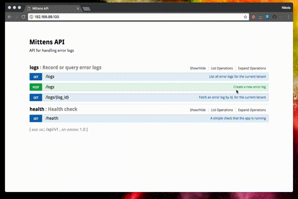

# Mittens


A scalable API service that collects JavaScript errors produced by visitors in multiple websites. Why mittens? Hot objects (like error logs) are best handled by wearing mitts!

* Python 3.6 - using the latest Python
* Flask - a micro-framework for web projects, that is flexible and has a great community
* uwsgi over nginx - a fast and pretty "standard" way of serving (C)Python
* MySQL - simple use case, so nothing too fancy, possibly would add queues 

## Features

* List, create and get error logs – (message) `content` and `meta` (data)
* Access control via `api_key` issued per tenant
* API documentation (Swagger) available at `http://127.0.0.1:5000/api/v1/`
* Filter desired fields in response with the `X-Fields` header
* Rate limiting on Nginx level, using `limit_req_zone` and `$http_x_forwarded_for` 

### Developer goodies

* Dependency management using `pip-tools` – quickly update, sync and install dependencies by editing [requirements.in](requirements.in) and doing `make pipup`
* [RESTful interface](mittens/logs/views.py) with `flask-restplus`
* DB migrations with `alembic`
* [Basic token authentication](mittens/auth.py)
* Run [unit & functional](tests) with `make test`
* Load testing with [locust](https://locust.io/)
* Access an IPython console with the Flask app context with `make console`

## Local development setup (sans Docker)

Make sure that you have [Python 3.6](.python-version) available on your system, and have the MySQL database, table and user setup as per [DevConfig](mittens/settings.py).

* Create a virtualenv inside your pyenv (or equivalent) for Python 3.6, and activate it
* Install all the dependencies: `pip install -r requirements.txt`
* You may initialize your local database with `make localdb` (assumes `root` user with no password)
* Run the migrations: `FLASK_APP=autoapp.py FLASK_DEBUG=1 flask db upgrade`
* Run the app server: `make app`

Adding and querying error logs is protected by simple API keys. In order to use the Mittens API, you need to create a
new tenant and give them an `api_key`. You can do this by entering the app console with `make console` and running:

```python
from mittens.db import db
from mittens.logs.models import Tenant

session = db.create_scoped_session()
session.add(Tenant(api_key="sk_test_123455678"))
session.commit()
```

## Start a Docker container on Kubernetes (Minikube)

```bash
minikube start
eval $(minikube docker-env)
docker-compose build
kubectl run mittens --image=mittens_web --port=80 --image-pull-policy=Never
kubectl expose deployment/mittens --type=NodePort
minikube service mittens
```

## Usage and documentation

You can Navigate to the root of the running server/container and find the interactive Swagger UI, which serves as API documentation.



## Tests

Run the unit and functional tests with the `make test` command.

You can also do load testing with [locust](https://locust.io/) by running the following:

`locust -f tests/locustfile.py --host={app uri}`

and then open `http://127.0.0.1:8089/` in your browser. 

## Improvements wishlist

* Configurable `limit_req_zone` parameters
* CI build
* Have a base Docker image for OS and Python dependencies
* Configuration management for deployment
* Use UUID instead of Integer for IDs
* Pagination
* JWT auth tokens
* Admin panel with the ability to search over error log content and metadata
* HTTPS
